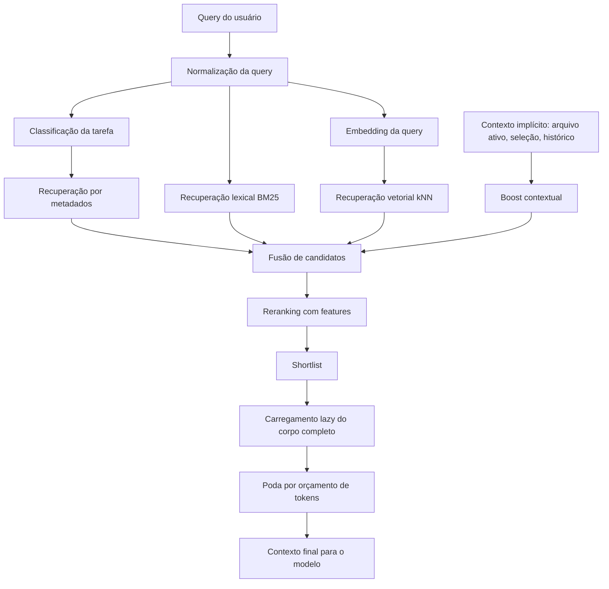
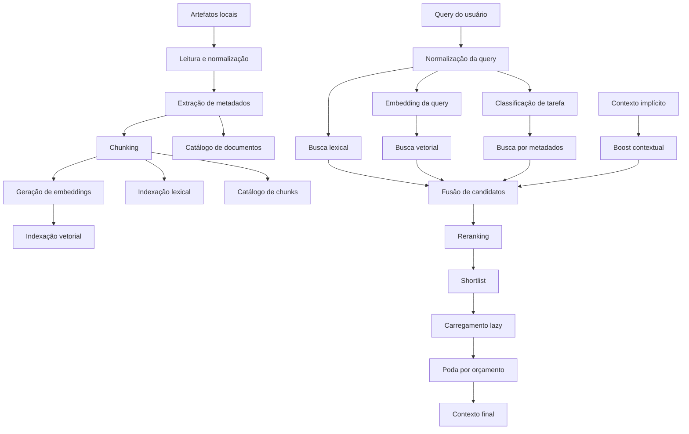
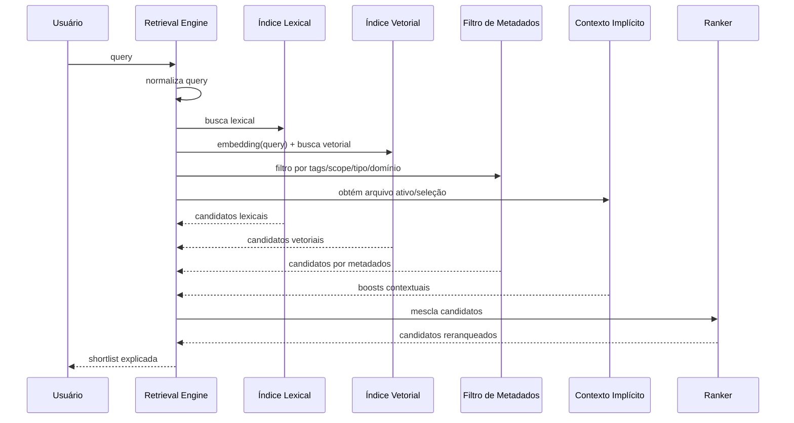

# Guia Técnico — Como Replicar no MCP um Comportamento Equivalente à Busca por Embeddings do Copilot

## Seção 1 — Prompt final

```markdown
# Objetivo

Quero implementar no meu MCP um mecanismo de recuperação de contexto que **replica funcionalmente** o comportamento de busca semântica por embeddings usado pelo Copilot sobre o codebase, **sem presumir detalhes internos não documentados do produto**.

A implementação deve ser desenhada para ser **determinística onde possível**, **explicável**, **auditável**, **de baixo acoplamento**, e com **carregamento lazy** do conteúdo completo. O objetivo não é copiar a implementação interna do Copilot, mas construir um pipeline equivalente em capacidade prática:

1. indexar artefatos locais;
2. gerar embeddings;
3. recuperar candidatos semanticamente;
4. combinar busca lexical, metadados e vetorial;
5. reranquear;
6. selecionar contexto final sob orçamento de tokens;
7. retornar evidência explícita de por que cada artefato foi escolhido.

---

## Restrições obrigatórias

- Não assuma nenhum mecanismo interno do Copilot que não esteja documentado publicamente.
- Trate como **FATO** apenas:
  - o Copilot usa índice do codebase;
  - o Copilot usa embeddings/semantic search em algum nível documentado;
  - instruction files relevantes podem ser detectados automaticamente;
  - `copilot-instructions.md` e `*.instructions.md` têm comportamento documentado parcial.
- Trate como **HIPÓTESE** qualquer afirmação sobre:
  - se o corpo textual de `*.instructions.md` entra no mesmo índice vetorial;
  - se `description` influencia ranking semântico;
  - o algoritmo exato de reranking;
  - thresholds internos de recuperação.
- Não simplifique conceitos técnicos com linguagem vaga.
- Defina cada termo técnico antes de usá-lo operacionalmente.
- Escreva todos os passos com granularidade suficiente para impedir ambiguidade de implementação.
- Quando houver trade-off, listar opções, custos, riscos e recomendação.
- Sempre separar claramente:
  - fato observado;
  - inferência plausível;
  - decisão de arquitetura do MCP.

---

## Escopo da solução

A solução deve cobrir:

1. **inventário de artefatos**
   - arquivos `.md`, `.instructions.md`, `.prompt.md`, `.cs`, `.json`, `.yml` e outros configuráveis;
2. **pipeline de ingestão**
   - leitura;
   - normalização;
   - extração de metadados;
   - chunking;
   - geração de embeddings;
   - persistência em índice lexical + índice vetorial;
3. **pipeline de consulta**
   - normalização da query;
   - classificação simples da tarefa;
   - recuperação paralela:
     - lexical;
     - metadados;
     - vetorial;
     - contexto implícito;
   - fusão de candidatos;
   - reranking;
   - poda por orçamento;
4. **observabilidade**
   - score por etapa;
   - motivo de inclusão;
   - motivo de exclusão;
   - logs estruturados;
5. **contratos de dados**
   - esquema de documento indexado;
   - esquema de chunk;
   - esquema de resultado de retrieval;
6. **critérios de aceite**
   - precisão de recuperação;
   - explicabilidade;
   - custo controlado;
   - comportamento estável em consultas ambíguas.

---

## Não objetivos

Não implementar nesta fase:

- fine-tuning de modelo;
- aprendizado supervisionado de ranker;
- inferência de política organizacional sem corpus explícito;
- autoedição de prompts em runtime;
- mudança automática de regras corporativas;
- dependência em comportamento opaco do Copilot.

---

## Glossário obrigatório

Antes de implementar, use exatamente estas definições operacionais:

- **Codebase**: conjunto dos arquivos do repositório elegíveis para indexação.
- **Índice lexical**: estrutura de busca textual exata ou aproximada, por exemplo BM25.
- **Índice vetorial**: estrutura que armazena embeddings para busca por similaridade.
- **Embedding**: vetor numérico que representa semanticamente um texto.
- **Chunk**: fragmento atômico de texto indexado separadamente.
- **Retrieval**: processo de recuperar candidatos relevantes a partir de uma query.
- **Reranking**: reordenação dos candidatos usando features adicionais após a recuperação inicial.
- **Shortlist**: conjunto reduzido de candidatos antes de carregar conteúdo completo.
- **Carregamento lazy**: só carregar corpo completo depois que o candidato já foi selecionado.
- **Orçamento de tokens**: limite máximo de conteúdo que pode ser enviado ao modelo final.
- **Contexto implícito**: sinais já disponíveis na sessão, como arquivo ativo, seleção e histórico.
- **Contexto explícito**: arquivos, URLs, símbolos ou referências anexadas intencionalmente.
- **Match lexical**: aderência baseada em termos.
- **Match semântico**: aderência baseada em embeddings.
- **Match por metadados**: aderência baseada em campos estruturados como tags, scope, tipo e domínio.

---

## Arquitetura obrigatória

Implemente um pipeline em fases.

### Fase 1 — Ingestão

1. Enumerar arquivos elegíveis.
2. Detectar tipo do artefato.
3. Extrair metadados.
4. Normalizar texto.
5. Dividir em chunks.
6. Gerar embeddings por chunk.
7. Persistir:
   - documento original;
   - chunks;
   - embeddings;
   - índice lexical;
   - metadados estruturados.

### Fase 2 — Consulta

1. Receber query do usuário.
2. Normalizar query.
3. Classificar intenção da tarefa.
4. Coletar contexto implícito.
5. Executar recuperação paralela:
   - lexical;
   - vetorial;
   - metadados;
   - priorização por contexto implícito.
6. Mesclar candidatos.
7. Aplicar reranking.
8. Selecionar shortlist.
9. Carregar conteúdo completo apenas para shortlist.
10. Podar por orçamento de tokens.
11. Emitir resultado com explicabilidade.

---

## Diagrama obrigatório

Gerar a arquitetura em Mermaid:



---

## Requisitos de chunking

Defina e implemente regras explícitas:

1. **Chunk por unidade semântica preferencial**
   - heading + bloco;
   - seção Markdown;
   - método/classe;
   - bloco de configuração;
   - trecho de documentação.
2. **Fallback por tamanho**
   - se uma unidade for grande demais, subdividir por parágrafo ou bloco lógico.
3. **Overlap**
   - usar overlap pequeno e controlado;
   - documentar tamanho exato.
4. **IDs estáveis**
   - cada chunk deve ter identificador determinístico derivado de:
     - caminho do arquivo;
     - tipo do artefato;
     - posição;
     - hash do conteúdo normalizado.
5. **Metadados por chunk**
   - `document_id`
   - `chunk_id`
   - `path`
   - `artifact_type`
   - `section_title`
   - `tags`
   - `scope`
   - `priority`
   - `kind`
   - `language`
   - `token_count_estimate`
   - `char_count`
   - `hash`
   - `last_modified_utc`

---

## Requisitos de normalização

Aplicar antes da indexação:

1. converter encoding para UTF-8;
2. normalizar fim de linha;
3. colapsar whitespace redundante sem destruir estrutura;
4. preservar headings, listas e blocos de código;
5. preservar frontmatter;
6. extrair campos estruturados;
7. manter texto original separadamente do texto normalizado;
8. não remover termos discriminativos de domínio;
9. não stemmizar de forma destrutiva termos técnicos.

---

## Requisitos de embeddings

1. O embedding deve ser gerado:
   - para a query;
   - para cada chunk;
   - opcionalmente para título e resumo.
2. O modelo de embedding deve ser configurável.
3. A dimensão vetorial deve ser persistida como metadado do índice.
4. O sistema deve permitir reindexação total quando:
   - o modelo mudar;
   - a estratégia de chunking mudar;
   - a normalização mudar.
5. Nunca misturar embeddings gerados por modelos diferentes no mesmo espaço vetorial sem versionamento explícito.

Campos obrigatórios:

- `embedding_model`
- `embedding_dimensions`
- `embedding_version`
- `normalization_version`
- `chunking_version`
- `indexed_at_utc`

---

## Requisitos de recuperação híbrida

Implementar três canais mínimos de recuperação.

### 1. Recuperação lexical
Usar BM25 ou equivalente.

### 2. Recuperação por metadados
Filtrar e pontuar por:
- `scope`
- `artifact_type`
- `kind`
- `tags`
- `domain`
- `task_type`
- arquivo ativo
- linguagem
- extensão
- módulo

### 3. Recuperação vetorial
Executar kNN por similaridade vetorial.

---

## Requisitos de fusão

Mesclar candidatos por `chunk_id` e `document_id`.

Cada candidato final intermediário deve carregar:

- score lexical normalizado;
- score vetorial normalizado;
- score de metadados;
- score de contexto implícito;
- score de prioridade do artefato;
- flags de conflito;
- origem dos matches.

---

## Requisitos de reranking

O reranking não pode ser caixa-preta nesta fase.

Implementar fórmula explícita ou ranker heurístico com pesos configuráveis.

Features mínimas:

1. score lexical;
2. score vetorial;
3. match exato de termos críticos;
4. match de domínio canônico;
5. match de tipo de tarefa;
6. aderência ao arquivo ativo;
7. aderência ao `scope`;
8. prioridade do artefato;
9. penalidade por conflito conhecido;
10. penalidade por baixa especificidade;
11. boost por densidade semântica;
12. penalidade por documento excessivamente genérico.

Exemplo de fórmula:

```text
final_score =
  (w_lexical * lexical_score) +
  (w_vector * vector_score) +
  (w_metadata * metadata_score) +
  (w_context * implicit_context_score) +
  (w_domain * domain_match_score) +
  (w_task * task_match_score) +
  (w_priority * priority_score) -
  (w_conflict * conflict_penalty) -
  (w_generic * genericity_penalty)
```

Todos os pesos devem ser configuráveis.

---

## Requisitos de desambiguação

Quando a confiança for baixa, o sistema não deve responder de forma assertiva demais.

Condições de baixa confiança:

- top-1 e top-2 muito próximos;
- conflito entre domínios conhecidos;
- query curta demais;
- baixa cobertura lexical;
- baixa convergência entre canais;
- contexto implícito insuficiente.

Nesses casos:
1. marcar baixa confiança;
2. registrar motivo;
3. opcionalmente solicitar clarificação.

---

## Requisitos de armazenamento

Separar pelo menos quatro camadas:

1. **Catálogo de documentos**
2. **Catálogo de chunks**
3. **Índice lexical**
4. **Índice vetorial**

Definir claramente:
- chave primária;
- versão do esquema;
- política de reindexação;
- política de atualização incremental;
- política de tombstone para arquivos removidos.

---

## Contratos de dados obrigatórios

### Documento indexado

```json
{
  "document_id": "string",
  "path": "string",
  "artifact_type": "instruction|markdown|code|config|other",
  "title": "string|null",
  "summary": "string|null",
  "tags": ["string"],
  "scope": "string|null",
  "kind": "policy|reference|other|null",
  "language": "string|null",
  "domain": ["string"],
  "task_types": ["string"],
  "priority": "low|medium|high|null",
  "hash": "string",
  "normalization_version": "string",
  "chunking_version": "string",
  "embedding_version": "string",
  "indexed_at_utc": "string"
}
```

### Chunk indexado

```json
{
  "chunk_id": "string",
  "document_id": "string",
  "path": "string",
  "section_title": "string|null",
  "ordinal": 0,
  "text_original": "string",
  "text_normalized": "string",
  "token_count_estimate": 0,
  "char_count": 0,
  "tags": ["string"],
  "scope": "string|null",
  "kind": "policy|reference|other|null",
  "domain": ["string"],
  "task_types": ["string"],
  "embedding_model": "string",
  "embedding_dimensions": 0,
  "embedding_version": "string",
  "vector": [0.0]
}
```

### Resultado de retrieval

```json
{
  "query": "string",
  "query_normalized": "string",
  "task_type": "string|null",
  "confidence": "high|medium|low",
  "candidates": [
    {
      "chunk_id": "string",
      "document_id": "string",
      "path": "string",
      "final_score": 0.0,
      "scores": {
        "lexical": 0.0,
        "vector": 0.0,
        "metadata": 0.0,
        "implicit_context": 0.0,
        "domain": 0.0,
        "task": 0.0,
        "priority": 0.0,
        "conflict_penalty": 0.0,
        "genericity_penalty": 0.0
      },
      "reasons_included": ["string"],
      "reasons_excluded": ["string"]
    }
  ],
  "selected_context": [
    {
      "chunk_id": "string",
      "path": "string",
      "selected_text": "string",
      "token_cost_estimate": 0
    }
  ]
}
```

---

## Critérios de aceite técnicos

A entrega só estará pronta se atender a todos:

1. existe ingestão incremental;
2. existe reindexação total;
3. existe índice lexical funcional;
4. existe índice vetorial funcional;
5. existe recuperação híbrida;
6. existe reranking configurável;
7. existe explicabilidade por candidato;
8. existe poda por orçamento de tokens;
9. existe logging estruturado;
10. existe teste para consultas ambíguas;
11. existe teste para conflito entre domínios próximos;
12. existe teste para arquivo ativo influenciando ranking;
13. existe teste para instruction file curto vs genérico;
14. existe documentação operacional de reindexação.

---

## Casos de teste mínimos

Implementar testes cobrindo:

1. RabbitMQ vs FIX
2. JWT vs OAuth client credentials
3. IMemoryCache vs Redis
4. fila vs tópico vs stream vs evento
5. prompt curto ambíguo
6. prompt longo discriminativo
7. conflito entre instrução global e instrução específica
8. description forte vs description genérica
9. arquivo correto com vocabulário fraco
10. arquivo errado com vocabulário forte

Para cada teste, validar:
- top-1;
- top-k;
- score explicado;
- confiança;
- pedido de clarificação quando aplicável.

---

## Observabilidade obrigatória

Gerar logs estruturados em cada etapa:

- início da ingestão;
- arquivo lido;
- chunk criado;
- embedding gerado;
- persistência concluída;
- query recebida;
- recuperação lexical concluída;
- recuperação vetorial concluída;
- recuperação por metadados concluída;
- reranking concluído;
- shortlist selecionada;
- contexto final podado.

Métricas mínimas:

- tempo de indexação por arquivo;
- tempo de embedding por chunk;
- tempo de busca lexical;
- tempo de busca vetorial;
- tempo de reranking;
- total de chunks;
- total de documentos;
- média de tokens por shortlist;
- taxa de consultas de baixa confiança.

---

## Estratégia de implementação obrigatória

Entregar em fases pequenas e verificáveis:

### Fase A
- catálogo de documentos;
- chunking;
- normalização;
- persistência sem embeddings.

### Fase B
- embeddings;
- índice vetorial;
- recuperação semântica simples.

### Fase C
- índice lexical;
- recuperação híbrida.

### Fase D
- reranking explicável;
- score breakdown.

### Fase E
- orçamento de tokens;
- carregamento lazy;
- observabilidade.

### Fase F
- suíte de testes com cenários ambíguos.

---

## Formato esperado da resposta técnica

Quero a resposta com estas seções obrigatórias:

1. **BMAD**
   - Background
   - Mission
   - Approach
   - Delivery/validation
2. **Fatos vs hipóteses**
3. **Arquitetura**
4. **Modelo de dados**
5. **Pipeline de ingestão**
6. **Pipeline de consulta**
7. **Reranking**
8. **Observabilidade**
9. **Plano de implementação por fases**
10. **Riscos e mitigação**
11. **Casos de teste**
12. **Checklist final**

Não omita nenhum passo. Não use frases genéricas como “implementar a lógica”, “fazer a indexação” ou “adicionar busca semântica” sem detalhar exatamente como.
```

## Seção 2 — Explicação da resposta

## Resposta curta para a sua pergunta original

Você **não consegue reproduzir o mecanismo interno exato do Copilot**, porque a Microsoft **não documenta** o algoritmo completo de indexação e recuperação.

Mas você consegue **replicar o comportamento funcional** dele no seu MCP com boa fidelidade usando um pipeline de **retrieval híbrido**:

- **índice lexical** para termos exatos;
- **índice vetorial com embeddings** para similaridade semântica;
- **metadados estruturados** para escopo, tipo e domínio;
- **reranking explicável** para reduzir falsos positivos;
- **carregamento lazy** para controlar custo de tokens.

## O que é fato e o que é hipótese

### Fatos documentados
Com base no seu documento e na documentação oficial citada nele:

- o Copilot mantém um **índice do codebase**;
- esse índice pode ser **local** ou **remoto**;
- o Copilot usa **embeddings** e **busca semântica** no codebase;
- instruction files relevantes podem ser detectados automaticamente;
- `copilot-instructions.md` e `*.instructions.md` podem entrar como contexto.

### Hipóteses plausíveis
O próprio documento trata como hipótese, não como fato:

- se o **corpo textual** dos instruction files entra no mesmo índice vetorial;
- se `description` influencia ranking;
- como é feito o reranking;
- qual threshold dispara a recuperação adicional;
- como conflitos entre instruções são resolvidos internamente.

## Conclusão prática

Então a estratégia correta para o seu MCP **não é tentar copiar o Copilot internamente**, e sim implementar um mecanismo **equivalente em capacidade observável**:

1. indexar artefatos locais;
2. gerar embeddings por chunk;
3. consultar por similaridade vetorial;
4. combinar com lexical e metadados;
5. reranquear com regras explícitas;
6. explicar por que cada item entrou.

## Base normativa usada para formatar esta resposta

Segui estes artefatos, cruzando policy com o pedido:

- **Repo**: `.github/copilot-instructions.md`
  - idioma português;
  - não assumir infra/código externo;
  - consultar MCP em decisões cross-cutting.
- **MCP `corporate-instructions`**
  - `assistant-workflow-bmad-planning-and-controlled-inference`
    - separar fato de hipótese; reduzir ambiguidade; estruturar planejamento.
  - `instruction-authoring-standard`
    - usar estrutura clara, critérios explícitos, limites e antiambiguidade.
  - `artifact-encoding-line-endings-and-unicode`
    - ao propor artefatos Markdown, assumir UTF-8 sem BOM e LF como convenção sugerida.

## Seção 3 — Detalhamento técnico

## 1. BMAD

### Background
Você quer construir no MCP um mecanismo equivalente ao comportamento de retrieval semântico observado no Copilot, mas com **governança**, **explicabilidade** e **controle de custo** maiores.

O problema principal é este:

- o Copilot faz semantic search no codebase;
- isso é útil para recall;
- mas o mecanismo interno exato não é público;
- portanto, o MCP precisa replicar **resultado prático**, não a implementação privada.

### Mission
Implementar uma arquitetura de retrieval que:

- encontre artefatos semanticamente relacionados à query;
- reduza colisões entre domínios próximos;
- preserve explicabilidade;
- permita auditoria;
- funcione bem com instruction files, markdown e código;
- use orçamento controlado de contexto.

### Approach
A solução correta é um **pipeline híbrido em duas metades**:

1. **Ingestão**
   - ler artefatos;
   - normalizar;
   - chunkar;
   - gerar embeddings;
   - indexar lexicalmente;
   - armazenar metadados e vetores.
2. **Consulta**
   - normalizar query;
   - inferir intenção da tarefa;
   - recuperar por lexical, vetorial e metadados;
   - mesclar;
   - reranquear;
   - podar por orçamento.

### Delivery/validation
A validação deve provar:

- recuperação semântica funcional;
- estabilidade do ranking;
- explicabilidade por score;
- comportamento controlado em ambiguidade;
- testes de colisão entre domínios próximos.

---

## 2. Arquitetura lógica

### 2.1 Visão de alto nível



### 2.2 Princípio central
O pipeline precisa ser **híbrido**, porque cada mecanismo corrige uma fraqueza diferente:

| Mecanismo | Forte em | Fraco em |
|---|---|---|
| Lexical | termos exatos, siglas, nomes | sinônimos, linguagem natural |
| Vetorial | similaridade semântica | confusão entre domínios próximos |
| Metadados | precisão por escopo e tipo | depende de boa curadoria |
| Contexto implícito | relevância local | insuficiente sozinho |

A decisão arquitetural do MCP é: **nunca depender de um canal único**.

---

## 3. Inventário de artefatos

## 3.1 Tipos de artefato recomendados

```plaintext
instruction
markdown
code
config
schema
prompt
adr
reference
other
```

## 3.2 Regra operacional
Cada arquivo deve receber um `artifact_type`.

Exemplo:

| Extensão/padrão | artifact_type |
|---|---|
| `.github/copilot-instructions.md` | instruction |
| `*.instructions.md` | instruction |
| `*.prompt.md` | prompt |
| `.md` genérico | markdown |
| `.cs` | code |
| `.json`, `.yml`, `.yaml` | config |

Isso é importante porque o tipo do artefato entra no ranking.

---

## 4. Normalização

## 4.1 Objetivo
A normalização prepara o texto para indexação **sem destruir sinal semântico**.

## 4.2 Regras técnicas
Aplicar nesta ordem:

1. detectar encoding;
2. converter para UTF-8;
3. normalizar fim de linha;
4. preservar frontmatter;
5. preservar headings;
6. preservar blocos de código;
7. reduzir whitespace redundante;
8. calcular hash do texto normalizado;
9. guardar também o texto original.

## 4.3 O que não fazer
Não fazer:

- lower-case destrutivo em tudo sem preservar original;
- stemming agressivo para termos técnicos;
- remoção de siglas;
- remoção de pontuação estrutural em Markdown.

Esses pontos degradam recuperação de domínios como `JWT`, `OAuth`, `RabbitMQ`, `FIX`.

---

## 5. Extração de metadados

## 5.1 Campos mínimos por documento

```json
{
  "document_id": "string",
  "path": "string",
  "artifact_type": "instruction|markdown|code|config|other",
  "title": "string|null",
  "tags": ["string"],
  "scope": "string|null",
  "kind": "policy|reference|other|null",
  "priority": "low|medium|high|null",
  "language": "string|null",
  "domain": ["string"],
  "task_types": ["string"],
  "hash": "string"
}
```

## 5.2 Campos mínimos por chunk

```json
{
  "chunk_id": "string",
  "document_id": "string",
  "ordinal": 0,
  "section_title": "string|null",
  "text_original": "string",
  "text_normalized": "string",
  "token_count_estimate": 0,
  "char_count": 0,
  "tags": ["string"],
  "scope": "string|null",
  "kind": "policy|reference|other|null",
  "domain": ["string"],
  "task_types": ["string"]
}
```

## 5.3 Por que isso importa
Sem metadados, o sistema fica excessivamente dependente de similaridade vetorial, e aí surgem falsos positivos como:

- RabbitMQ vs FIX
- JWT vs OAuth
- IMemoryCache vs Redis

---

## 6. Chunking

## 6.1 Definição
**Chunk** é a menor unidade indexável que o sistema usa na busca.

## 6.2 Regra correta
O chunk deve seguir **unidade semântica**, não só tamanho fixo.

### Ordem de preferência
1. seção Markdown;
2. heading + conteúdo;
3. método/classe;
4. bloco de configuração;
5. parágrafo ou bloco lógico.

## 6.3 Exemplo de chunking em Markdown

```markdown
## Requisitos de retry

- Usar backoff exponencial.
- Limitar número de tentativas.
- Enviar para DLQ quando esgotado.
```

Esse bloco pode ser um chunk único.

## 6.4 Overlap
Use overlap pequeno apenas para preservar continuidade.

Exemplo recomendado:
- chunk alvo: 300 a 800 tokens;
- overlap: 30 a 80 tokens.

O overlap não deve ser grande, senão:
- aumenta custo;
- duplica sinal;
- distorce ranking.

## 6.5 IDs estáveis
O `chunk_id` deve ser determinístico.

Exemplo de composição:

```plaintext
chunk_id = SHA256(path_normalized + section_title + ordinal + normalized_text_hash)
```

Isso evita reindexações inconsistentes.

---

## 7. Embeddings

## 7.1 Definição operacional
Embedding é um vetor numérico que representa a proximidade semântica de um texto com outros textos no mesmo espaço vetorial.

## 7.2 Regra de implementação
Gerar embedding para:

- query;
- cada chunk;
- opcionalmente título e resumo.

## 7.3 Versionamento obrigatório
Nunca misturar embeddings sem versionamento.

Persistir:

```json
{
  "embedding_model": "text-embedding-3-small",
  "embedding_dimensions": 1536,
  "embedding_version": "v1",
  "normalization_version": "v1",
  "chunking_version": "v1"
}
```

Se qualquer desses mudar, o correto é **reindexar**.

## 7.4 Armazenamento vetorial
Você precisa de um armazenamento que suporte kNN / ANN.

Opções típicas:

- Azure AI Search
- Pinecone
- Weaviate
- Milvus
- pgvector
- Redis com vetor

A escolha depende de:
- custo;
- operação;
- latência;
- governança.

Para MVP corporativo, a opção mais pragmática costuma ser um serviço gerenciado.

---

## 8. Índice lexical

## 8.1 Objetivo
Cobrir casos em que o usuário usa termos exatos e discriminativos.

Exemplos:
- `client_credentials`
- `ProblemDetails`
- `DLQ`
- `IMemoryCache`

## 8.2 Tecnologia
BM25 ou equivalente é suficiente.

## 8.3 Regra de ouro
Não substituir lexical por vetorial.
Os dois devem coexistir.

---

## 9. Recuperação híbrida

## 9.1 Fluxo



## 9.2 Canais mínimos

### Canal lexical
Recupera por termos exatos.

### Canal vetorial
Recupera por similaridade semântica.

### Canal de metadados
Aplica filtros e boosts por:
- scope;
- kind;
- tags;
- domínio;
- tipo de tarefa;
- módulo;
- arquivo ativo.

### Canal contextual
Usa:
- arquivo aberto;
- seleção ativa;
- histórico;
- linguagem do arquivo;
- pasta/módulo ativo.

---

## 10. Fusão de candidatos

## 10.1 Problema
Os mesmos chunks podem aparecer em múltiplos canais com scores incompatíveis.

## 10.2 Solução
Normalizar scores por canal para faixa comum, por exemplo `0..1`.

## 10.3 Estrutura intermediária

```json
{
  "chunk_id": "abc",
  "document_id": "doc-1",
  "scores": {
    "lexical": 0.82,
    "vector": 0.76,
    "metadata": 1.00,
    "implicit_context": 0.40
  },
  "origins": ["lexical", "vector", "metadata"]
}
```

## 10.4 Regra importante
A fusão não é a etapa final. Ela só prepara o reranking.

---

## 11. Reranking

## 11.1 Objetivo
Reduzir falsos positivos “parecidos demais, mas errados”.

## 11.2 Features mínimas
O ranker heurístico precisa considerar:

1. score lexical;
2. score vetorial;
3. aderência de domínio;
4. aderência de tipo de tarefa;
5. match com arquivo ativo;
6. match com scope;
7. prioridade do artefato;
8. conflito conhecido;
9. genericidade excessiva;
10. densidade semântica.

## 11.3 Fórmula recomendada

```plaintext
final_score =
  (0.20 * lexical_score) +
  (0.30 * vector_score) +
  (0.20 * metadata_score) +
  (0.10 * implicit_context_score) +
  (0.10 * domain_match_score) +
  (0.05 * task_match_score) +
  (0.05 * priority_score) -
  (0.10 * conflict_penalty) -
  (0.05 * genericity_penalty)
```

Os pesos acima são apenas ponto de partida. Devem ser calibrados por experimento.

## 11.4 Conflitos conhecidos
Você pode manter um catálogo de pares semanticamente próximos, mas não equivalentes:

```json
{
  "conflicts": [
    ["rabbitmq", "fix"],
    ["jwt-validation", "oauth-client-credentials"],
    ["imemorycache", "redis-distributed"],
    ["queue", "topic"],
    ["topic", "stream"],
    ["rest-sync", "messaging-async"]
  ]
}
```

Se top candidatos vierem de domínios conflitantes, aplique penalidade ou baixe confiança.

---

## 12. Classificação da tarefa

## 12.1 Por que isso importa
A mesma query muda de sentido conforme a intenção:

- explicar;
- implementar;
- depurar;
- decidir arquitetura;
- validar policy.

## 12.2 MVP suficiente
No começo, um classificador por regras já ajuda bastante.

Exemplo:

| Sinal na query | task_type |
|---|---|
| “como implementar”, “exemplo”, “código” | implementation |
| “por que falha”, “erro”, “debug” | troubleshooting |
| “devo usar”, “qual padrão”, “arquitetura” | architecture |
| “qual regra”, “policy”, “padrão corporativo” | policy-validation |

Esse `task_type` entra no ranking.

---

## 13. Contexto implícito

## 13.1 O que é
É o conjunto de sinais já presentes na sessão.

Exemplos:
- arquivo ativo;
- seleção;
- pasta/módulo;
- linguagem;
- símbolos próximos.

## 13.2 Uso correto
O contexto implícito não substitui retrieval, mas ajusta prioridade.

Exemplo:
se o arquivo ativo está no módulo de mensageria, boosts de `RabbitMQ` fazem sentido e boosts de `HttpClient` caem.

---

## 14. Carregamento lazy

## 14.1 Definição
Não carregar o corpo completo de tudo no começo.

## 14.2 Regra operacional
Fluxo correto:

1. indexar tudo previamente;
2. recuperar candidatos por vetores/lexical/metadados;
3. formar shortlist;
4. só então carregar corpo completo;
5. podar por orçamento.

## 14.3 Benefício
Isso reduz:
- custo de tokens;
- ruído contextual;
- chance de contexto irrelevante dominar.

---

## 15. Orçamento de tokens

## 15.1 Problema
Mesmo recuperação boa pode gerar contexto demais.

## 15.2 Solução
Estabelecer dois limites:
- máximo por chunk/documento;
- máximo global da shortlist.

Exemplo:

```plaintext
max_chunk_tokens = 700
max_total_context_tokens = 3500
```

## 15.3 Estratégia de poda
Ordenar por score final e incluir até atingir orçamento.

Se o próximo item exceder orçamento:
- truncar de forma semântica;
- ou descartar;
- registrar motivo.

---

## 16. Observabilidade

## 16.1 Logs estruturados
Cada consulta precisa registrar:

```json
{
  "query": "Como devo tratar retries nesta integração?",
  "task_type": "implementation",
  "active_file": "Messaging/Publisher.cs",
  "lexical_hits": 12,
  "vector_hits": 15,
  "metadata_hits": 4,
  "top_candidates": [
    {
      "chunk_id": "x1",
      "path": "microservice-messaging-rabbitmq-publish-consume.md",
      "final_score": 0.89,
      "reason": [
        "match_semantico_alto",
        "tag_rabbitmq",
        "arquivo_ativo_mensageria"
      ]
    }
  ],
  "confidence": "medium"
}
```

## 16.2 Métricas úteis
Medir:

- latência de busca lexical;
- latência de embedding da query;
- latência de busca vetorial;
- latência de reranking;
- total de candidatos;
- taxa de baixa confiança;
- top-1 correto;
- top-k contém correto;
- custo médio de contexto.

---

## 17. Experimentos de validação

## 17.1 Casos obrigatórios
Os que o seu documento propôs são exatamente os certos:

1. RabbitMQ vs FIX
2. JWT vs OAuth client credentials
3. IMemoryCache vs Redis
4. fila vs tópico vs stream vs evento
5. instrução curta vs longa
6. description forte vs description genérica
7. conflito entre instrução global e específica
8. arquivo correto com vocabulário ruim
9. arquivo ruim com vocabulário forte
10. influência do arquivo ativo
11. prompt longo discriminativo

## 17.2 Métricas mínimas
Para cada experimento, registrar:

- prompt exato;
- arquivo ativo;
- seleção ativa;
- top-1;
- top-k;
- score breakdown;
- confiança;
- se houve clarificação;
- falso positivo;
- custo de contexto.

---

## 18. Fases de implementação

## Fase A — Base documental
Entregar:
- catálogo de documentos;
- normalização;
- chunking;
- metadados.

Sem embeddings ainda.

## Fase B — Vetorial
Entregar:
- geração de embeddings;
- armazenamento vetorial;
- busca kNN.

## Fase C — Lexical
Entregar:
- índice BM25;
- busca lexical;
- normalização de scores.

## Fase D — Híbrido
Entregar:
- fusão dos canais;
- reranking heurístico;
- score breakdown.

## Fase E — Contexto final
Entregar:
- shortlist;
- carregamento lazy;
- poda por orçamento.

## Fase F — Qualidade
Entregar:
- observabilidade;
- testes ambíguos;
- métricas de precisão.

---

## 19. Riscos e mitigação

| Risco | Causa | Mitigação |
|---|---|---|
| Falso positivo semântico | embeddings aproximam domínios próximos | reranking + taxonomia + conflitos |
| Baixa cobertura lexical | query fora do vocabulário | vetor + aliases + tags |
| Metadados ruins | curadoria fraca | esquema obrigatório + revisão |
| Custo alto de contexto | carregar tudo cedo | shortlist + lazy loading |
| Instabilidade de ranking | pesos ruins | benchmark + calibração |
| Mistura de embeddings incompatíveis | troca de modelo sem versionamento | versionamento + reindexação |

---

## 20. Checklist final de implementação

```markdown
- [ ] Existe normalização determinística
- [ ] Existe extração de metadados
- [ ] Existe chunking semântico
- [ ] Existe versionamento de chunking/normalização/embedding
- [ ] Existe índice vetorial
- [ ] Existe índice lexical
- [ ] Existe busca por metadados
- [ ] Existe fusão de candidatos
- [ ] Existe reranking explicável
- [ ] Existe suporte a baixa confiança
- [ ] Existe carregamento lazy
- [ ] Existe orçamento de tokens
- [ ] Existe logging estruturado
- [ ] Existem métricas operacionais
- [ ] Existem testes de ambiguidade
- [ ] Existem testes de conflito entre domínios
- [ ] Existe documentação de reindexação
```

## 21. Síntese final

A forma tecnicamente correta de replicar o comportamento do Copilot no seu MCP é:

1. **indexar localmente os artefatos**;
2. **chunkar por unidade semântica**;
3. **gerar embeddings por chunk**;
4. **usar busca vetorial + lexical + metadados**;
5. **reranquear de forma explícita**;
6. **selecionar contexto final com orçamento**;
7. **medir e explicar cada decisão**.

Isso não replica a implementação privada da Microsoft, mas replica o que importa de verdade para o seu objetivo: **recall semântico com governança, precisão e auditabilidade**.
